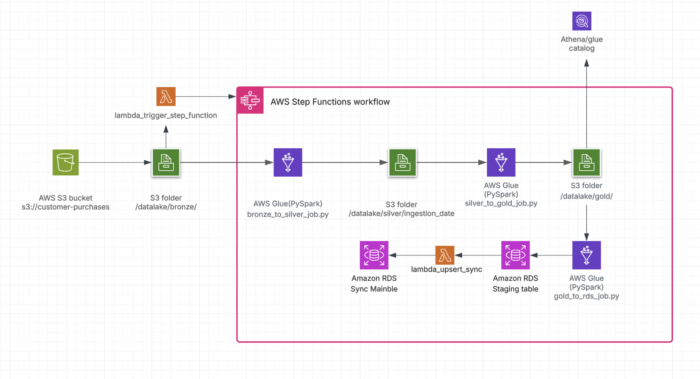

# Customer Purchases Data Pipeline

## Overview

This repository showcases a **production-ready, enterprise-grade ETL data pipeline** built on AWS cloud infrastructure to process customer purchase data from raw ingestion to analytics-ready insights. The solution implements a modern **Medallion Architecture** pattern, orchestrating seamless data transformations across **Bronze → Silver → Gold** layers using **AWS Glue**, **AWS Step Functions**, and **AWS Lambda**.

---

## Solution Highlights

### **High-Level Design Features**

#### **Medallion Architecture Pattern**
- **Bronze Layer**: Raw data ingestion and storage
- **Silver Layer**: Cleaned, validated, and standardized data
- **Gold Layer**: Business-ready, aggregated analytics datasets

#### **Event-Driven & Serverless Architecture**
- Fully automated pipeline with zero manual intervention
- Event-driven orchestration triggered by S3 file uploads
- Serverless components ensure cost optimization and infinite scalability

#### **Incremental Processing**
- Smart data processing - only new data is processed each time
- Optimized for performance and cost efficiency

#### **Scalability & Reliability**
- **AWS Glue** leverages Apache Spark for distributed processing
- **Amazon S3** provides virtually unlimited storage with 99.999999999% durability
- **AWS Step Functions** ensure fault-tolerant orchestration with built-in retries and error handling

#### **Extensible Design**
- Ready for integration with downstream systems (Redshift, Elasticsearch, BI tools)
- Modular architecture supports easy feature additions

###  **Low-Level Design Features**

#### **Software Engineering Best Practices**
- **Object-Oriented Design**: Modularized codebase following OOP principles
- **Separation of Concerns**: Clear architectural boundaries and responsibilities
- **Code Reusability**: Common functionalities abstracted into reusable components

#### **Quality Assurance**
- **Unit Testing**: Integrated testing framework for reliability
- **Testable Architecture**: Code designed for comprehensive test coverage

---

## Implementation Scope

### **Planned Enhancements** (Out of Current Scope)
1. **Full Modularization**: Currently demonstrated in `bronze_to_silver` layer - remaining layers can be restructured using the same OOP approach
2. **Comprehensive Testing Suite**: Unit tests implemented for core classes - full test coverage expansion planned
3. **Infrastructure as Code**: Deployment automation using AWS CloudFormation/Terraform and CI/CD with AWS CodePipeline/GitHub Actions

---

## Architecture Overview



## Data Flow Pipeline

###  **1. Raw Data Ingestion (Bronze Layer)**
```
📍 Location: s3://customer-purchases/datalake/bronze/
📂 Structure: Partitioned by year/month/day of ingestion date
📄 Format: CSV files containing customer purchase transactions
```

### **2. Intelligent Event Triggering**
- **S3 Event** → **Lambda Function** (`lambda_trigger_step_function`)
- Automatic detection of new data arrivals
- Seamless **AWS Step Functions workflow** initiation

### **3. Bronze → Silver Transformation**
```python
# AWS Glue Job: bronze_to_silver_job.py
```
- **Data Cleaning & Standardization**: Raw data validation and cleansing
- **Quality Assurance**: Comprehensive data validation layer
- **Output**: `s3://customer-purchases/datalake/silver/ingestion_date=YYYY-MM-DD/`
- **Optimization**: Partitioned by ingestion_date for efficient downstream processing

### **4. Silver → Gold Transformation**
```python
# AWS Glue Job: silver_to_gold_job.py
```
- Customer-level data aggregation
- `full_name` column generation
- Key metrics calculation:
  - `total_spent_aud`
  - `first_purchase_date`
  - `last_purchase_date`

**Output**: `s3://customer-purchases/datalake/gold/year=YYYY/month=MM/day=DD/`

** Lakehouse Architecture**: Data queryable via **Amazon Athena** using AWS Glue Data Catalog

### **5. Gold → RDS Staging Load**
```python
# AWS Glue Job: gold_to_rds_job.py
```
- Latest gold data extraction
- **Amazon RDS staging table** population via JDBC
- Append mode for incremental loading

### **6. Production Data Synchronization**
```python
# AWS Lambda: lambda_upsert_sync
```
**UPSERT Operations:**
-  Insert new customer records
-  Update existing customer metrics
-  Maintain `customer_purchase_summary` table consistency

---

## Orchestration Architecture

### **AWS Step Functions Workflow**

The entire pipeline is orchestrated through a sophisticated **AWS Step Functions** state machine, ensuring reliable, fault-tolerant execution.

#### ** Configuration File**: `step_function.yaml`

```yaml
Comment: "ETL pipeline with file-specific arguments"
StartAt: BronzeToSilver
States:
  BronzeToSilver:
    Type: Task
    Resource: arn:aws:states:::glue:startJobRun.sync
    Parameters:
      JobName: "bronze_to_silver_job"
      Arguments:
        "--year.$": "$.year"
        "--month.$": "$.month"
        "--day.$": "$.day"
        "--s3_path.$": "$.s3_path"
    Next: SilverToGold
    Catch:
      - ErrorEquals: ["States.ALL"]
        ResultPath: "$.error"
        Next: FailureNotification

  SilverToGold:
    Type: Task
    Resource: arn:aws:states:::glue:startJobRun.sync
    Parameters:
      JobName: "silver_to_gold_job"
      Arguments:
        "--year.$": "$.year"
        "--month.$": "$.month"
        "--day.$": "$.day"
    Next: GoldToRDS
    Catch:
      - ErrorEquals: ["States.ALL"]
        ResultPath: "$.error"
        Next: FailureNotification

  GoldToRDS:
    Type: Task
    Resource: arn:aws:states:::glue:startJobRun.sync
    Parameters:
      JobName: "gold_to_rds_job"
      Arguments:
        "--year.$": "$.year"
        "--month.$": "$.month"
        "--day.$": "$.day"
    Next: UpsertToRDS
    Catch:
      - ErrorEquals: ["States.ALL"]
        ResultPath: "$.error"
        Next: FailureNotification

  UpsertToRDS:
    Type: Task
    Resource: arn:aws:states:::lambda:invoke
    Parameters:
      FunctionName: "upsert_to_rds_lambda"
      Payload:
        year.$: "$.year"
        month.$: "$.month"
        day.$: "$.day"
    Next: SuccessNotification
    Catch:
      - ErrorEquals: ["States.ALL"]
        ResultPath: "$.error"
        Next: FailureNotification

  SuccessNotification:
    Type: Pass
    Result:
      Message: "ETL pipeline completed successfully"
    End: true

  FailureNotification:
    Type: Fail
    Error: "ETLJobFailed"
    Cause: "One of the Glue jobs or Lambda failed."
```

---

## 🗄️ Database Schema Design

### **Staging Table Structure**
```sql
CREATE TABLE customer_purchase_summary_staging (
    customer_id INT,
    full_name VARCHAR(255),
    email VARCHAR(255),
    total_spent_aud DECIMAL(18, 2),
    first_purchase_date DATE,
    last_purchase_date DATE,
    load_date TIMESTAMP DEFAULT CURRENT_TIMESTAMP
);
```

### **Production Table Structure**
```sql
CREATE TABLE customer_purchase_summary (
    customer_id INT PRIMARY KEY,
    full_name VARCHAR(255),
    email VARCHAR(255),
    total_spent_aud DECIMAL(18, 2),
    first_purchase_date DATE,
    last_purchase_date DATE,
    updated_at TIMESTAMP DEFAULT CURRENT_TIMESTAMP ON UPDATE CURRENT_TIMESTAMP
);
```

### **Performance Optimization**
```sql
CREATE INDEX idx_total_spent_desc 
ON customer_purchase_summary (total_spent_aud DESC);
```

---

## Business Intelligence Query

### **Top 5 Customers by Total Spend**
```sql
SELECT customer_id, 
       full_name, 
       email, 
       total_spent_aud
FROM customer_purchase_summary
ORDER BY total_spent_aud DESC
LIMIT 5;
```

---

## Key Benefits

- ✅ **Cost Optimized**: Serverless architecture with pay-per-use pricing
- ✅ **Scalable**: Handles data growth seamlessly
- ✅ **Reliable**: Built-in error handling and retry mechanisms
- ✅ **Maintainable**: Clean, modular code following industry best practices
- ✅ **Analytics-Ready**: Direct integration with BI tools and data science workflows

---

## Getting Started

### Prerequisites
- AWS Account with appropriate permissions
- AWS CLI configured
- Python 3.8+ for local development

---
